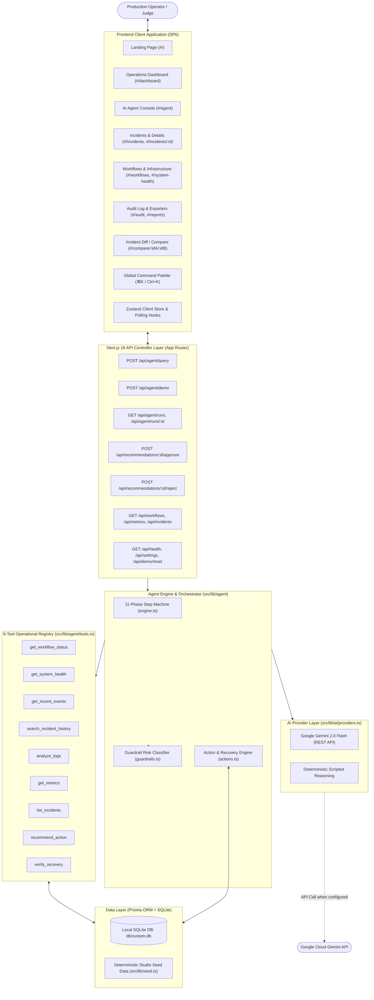
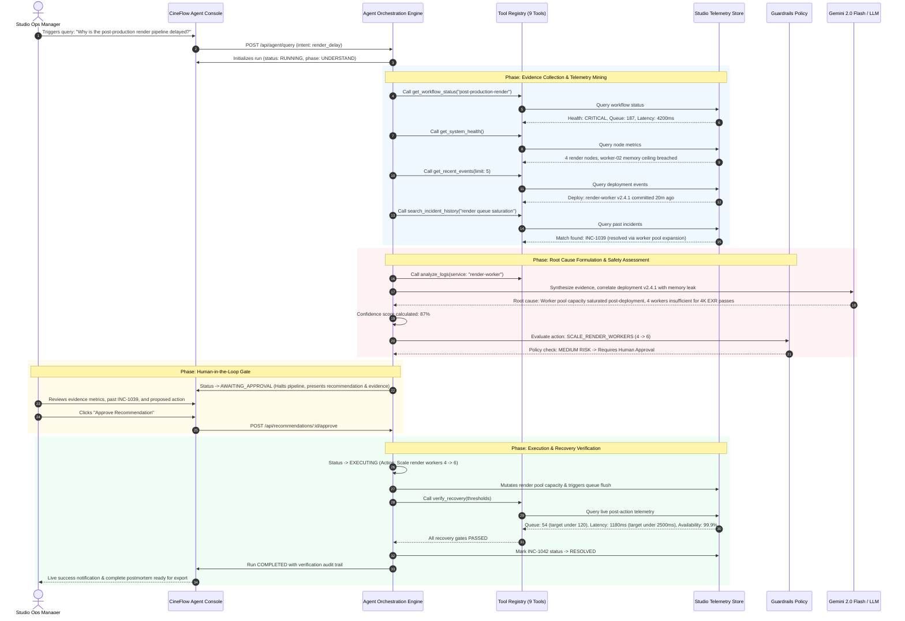
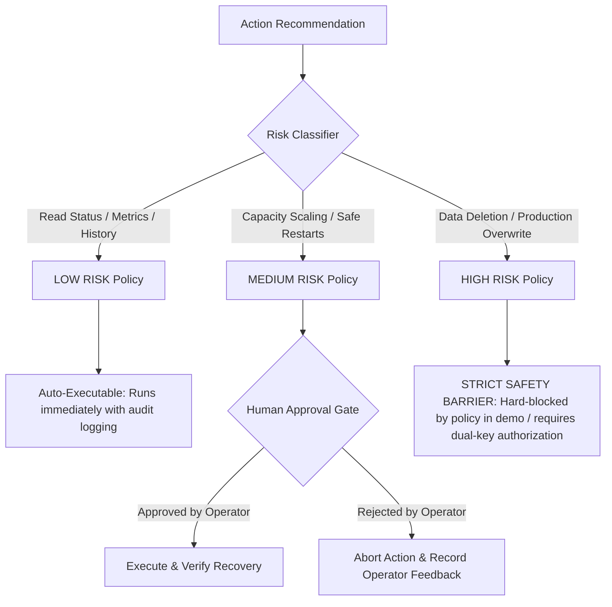
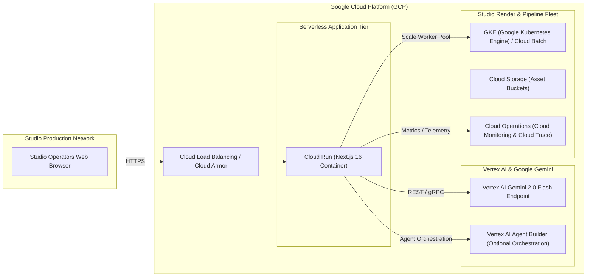

<p align="center">
  
</p>

<h1 align="center">CineFlow AI</h1>

<p align="center">
  <strong>Autonomous Production Operations Assistant for Film & Media Studios</strong><br />
  <em>Built for <strong>Agentic Cinema: The Blockbuster Hackathon</strong></em>
</p>

<p align="center">
  
  
  
  
  
  
</p>

---

## 🎬 Project Overview

Modern film and virtual production pipelines operate under high-stakes deadlines. Ingest nodes, transcoders, 4K/8K VFX render fleets, color grading clusters, and master distribution pipelines process millions of assets daily. When an anomaly occurs, operators typically waste critical hours switching between telemetry dashboards, correlating deployments, and manually tracing root causes across disjointed tools.

**CineFlow AI** is an agentic, evidence-grounded production operations assistant engineered specifically for media studios. It provides an autonomous yet tightly governed incident lifecycle:

1. **Detects** telemetry anomalies across 24 production workflows in real time.
2. **Diagnoses** issues by executing structured diagnostic tools against logs, infrastructure metrics, and deployment history.
3. **Formulates Evidence-Grounded Root Causes** with calculated confidence scores.
4. **Applies Policy Guardrails** (LOW, MEDIUM, HIGH) to enforce strict safety constraints.
5. **Human-in-the-Loop Authorization Gate**: Halts execution for risky operations (such as compute scaling or service restarts) until human authorization is granted.
6. **Autonomous Remediation & Self-Verification**: Executes approved actions and continuously verifies recovery thresholds before marking incidents resolved.

---

## 🏆 Built for the Hackathon

> **Agentic Cinema: The Blockbuster Hackathon**  
> *Category: AI Agents in Production & Pipeline Engineering*

### Key Hackathon Requirements Addressed
- **Real Agentic Autonomy**: Operates through an 11-phase state machine (`UNDERSTAND` → `COLLECT` → `ANALYZE` → `ROOT_CAUSE` → `CONFIDENCE` → `RISK` → `RECOMMEND` → `APPROVAL` → `ACTION` → `VERIFY` → `RESOLVE`).
- **Google Gemini Integration**: Native REST adapter to **Google Gemini 2.0 Flash** (`generativelanguage.googleapis.com`) with deterministic fallback to ensure complete reproducibility during evaluation.
- **Enterprise Safety & Guardrails**: Multi-tier risk policy engine where destructive actions are strictly blocked and operations impacting cost/capacity require explicit human approval.
- **Zero Hallucination Standard**: The agent never fabricates facts or metric values; every diagnostic claim is directly tied to a verifiable tool execution output.

---

## 🏛️ Comprehensive Architecture & Flow Diagrams

### 1. High-Level System Architecture



---

### 2. Autonomous Incident Triage & Resolution Flow (End-to-End)



---

### 3. Guardrail Risk Classification Matrix



---

### 4. Production Google Cloud Platform Deployment Topology



---

## 🛠️ Tool Registry Breakdown

CineFlow AI contains 9 built-in operational tools that execute real database queries against studio assets:

| Tool Name | Parameters | Safety Level | Operational Behavior |
| :--- | :--- | :--- | :--- |
| `get_workflow_status` | `workflowKey: string` | **LOW** | Retrieves current health, active jobs, queue depth, throughput, and error rates. |
| `get_system_health` | *none* | **LOW** | Returns aggregate cluster CPU, GPU, memory, and availability percentages. |
| `get_recent_events` | `limit: number` | **LOW** | Retrieves chronological deployment logs, config changes, and studio alerts. |
| `search_incident_history`| `query: string` | **LOW** | Searches resolved incidents using keyword and semantic pattern matching. |
| `analyze_logs` | `service: string` | **LOW** | Parses service log files to calculate error spikes and failure patterns. |
| `get_metrics` | `keys?: string[]` | **LOW** | Pulls real-time numerical telemetry metrics (e.g. queue depth, latency). |
| `list_incidents` | `status?: string` | **LOW** | Lists all active, investigating, or resolved studio incidents. |
| `recommend_action` | `incidentId, type, ...`| **MEDIUM** | Formulates an action proposal with calculated confidence and risk tier. |
| `verify_recovery` | `workflowKey, thresholds`| **LOW** | Tests live telemetry against defined thresholds to verify incident recovery. |

---

## 💻 Tech Stack & Engineering Highlights

- **Next.js 16 (App Router with Turbopack)**: Hybrid server-side API execution and client-side single-page architecture.
- **Google Gemini 2.0 Flash**: High-speed, high-context AI model reasoning via direct server-side REST calls.
- **Prisma ORM & SQLite**: Deterministic local database providing instant seeding, relational integrity, and rapid resets.
- **Tailwind CSS 4**: Modern styling with rich contrast, responsive layouts, and smooth animations.
- **Zustand Store**: Lightweight client-side state machine handling polling loops, command palette state, and view hydration.
- **Lucide Icons & Sonner**: Crisp iconography and interactive toast feedback for approvals and exports.

---

## 🚀 Quick Start & Local Setup

### Prerequisites
- [Bun](https://bun.sh) (v1.1+ recommended) or [Node.js](https://nodejs.org) (v20+ / v22+)

### 1. Clone & Install Dependencies
```bash
git clone https://github.com/your-username/cineflow-ai.git
cd "CineFlow AI"

# Install dependencies
bun install
# or: npm install
```

### 2. Configure Environment Variables (Optional)
CineFlow AI runs fully in deterministic demo mode without external API keys. To enable live Gemini reasoning, set:
```bash
cp .env.example .env
```
Inside `.env`:
```env
DATABASE_URL="file:../db/custom.db"
GEMINI_API_KEY="your-gemini-api-key-here"     # Optional: enables live Gemini reasoning
GEMINI_MODEL="gemini-2.0-flash"               # Optional: defaults to gemini-2.0-flash
```

### 3. Generate Database Client & Start Dev Server
```bash
# Generate Prisma Client
bunx prisma generate

# Launch Development Server
bun run dev
```

Open [http://localhost:3000](http://localhost:3000) in your browser.

---

## 🎯 The 2-Minute Judging Walkthrough

To review the primary scenario judged during the hackathon:

1. **Access the Dashboard**: Open [http://localhost:3000/#/dashboard](http://localhost:3000/#/dashboard). Note the 24 studio workflows and active incidents (especially **INC-1042: 4K VFX Render Farm Saturation**).
2. **Launch the Autonomous Agent**: Click **Run Demo Scenario** in the top navigation bar.
3. **Inspect the Reasoning Loop**:
   - Watch the agent execute `get_workflow_status`, `get_system_health`, and `analyze_logs`.
   - Review how the agent correlates the queue spike (+42%) with the recent `render-worker v2.4.1` deploy.
   - Note the root cause explanation and calculated **87% Confidence Score**.
4. **Experience the Approval Gate**:
   - The agent pauses at `AWAITING_APPROVAL` because `SCALE_RENDER_WORKERS` is classified as **MEDIUM RISK**.
   - Inspect the recommendation details and click **Approve Recommendation**.
5. **Observe Self-Verification**:
   - The action executes (scaling workers from 4 to 6).
   - The agent automatically calls `verify_recovery` and re-tests the SLA thresholds.
   - Queue drops from 187 to 54; latency drops from 4,200ms to 1,180ms.
   - Incident **INC-1042** transitions to **RESOLVED**.
6. **Export Audit & Postmortem**:
   - Navigate to **Reports** or **Incident Details** to copy or download the complete Markdown postmortem.

---

## ⌨️ Global Keyboard Shortcuts

| Shortcut | Action |
| :--- | :--- |
| `?` | Open Keyboard Shortcuts Help Modal |
| `⌘K` or `Ctrl+K` | Open Global Command Palette |
| `D` | Navigate to Operations Dashboard |
| `A` | Navigate to AI Agent Console |
| `I` | Navigate to Incidents List |
| `W` | Navigate to Workflows View |
| `H` | Navigate to System Health / Infrastructure |
| `R` | Trigger Run Demo Scenario |

---

## 🔒 Security & Privacy

- **Zero Client-Side Keys**: API keys (`GEMINI_API_KEY`) are kept strictly server-side in Next.js route handlers.
- **Fail-Safe Risk Defaults**: Any unrecognized or ambiguous action type automatically defaults to **HIGH RISK** and will never auto-execute.
- **Sanitized Exports**: Generated Markdown transcripts and CSV audit trails sanitize runtime tokens and internal credentials.
- **Contained Demo Environment**: Demo actions mutate only the isolated local SQLite store and are clearly labeled in the interface.

---

<p align="center">
  <strong>CineFlow AI</strong> · Agentic Cinema: The Blockbuster Hackathon
</p>
